# AMS SOFT – Fail2Ban Manager para WHMCS

> **Leve o fail2ban a outro nível — integrado ao WHMCS, com dashboard visual, IA da Anthropic (Claude) para análise de ataques, criação automática de filtros, relatórios e muito mais. Tudo sem precisar de linha de comando ou terminal.**

---

## O que é este módulo?

O **AMS SOFT Fail2Ban Manager** transforma o fail2ban em uma ferramenta visual e inteligente dentro do próprio WHMCS. Em vez de gerenciar segurança via SSH, você tem um painel completo com gráficos em tempo real, controle de IPs e jails por botão, análise de logs por Inteligência Artificial e relatórios exportáveis — tudo acessível pelo admin do WHMCS, sem instalar nada extra no navegador.

A IA integrada (Claude, da Anthropic) não apenas sugere banir um IP suspeito: ela lê as linhas de log, identifica o **padrão** do ataque e cria automaticamente um filtro fail2ban (`failregex`) para que qualquer futuro IP que use o mesmo vetor seja bloqueado de forma autônoma — sem intervenção humana.

## Capturas de Tela

**Dashboard**

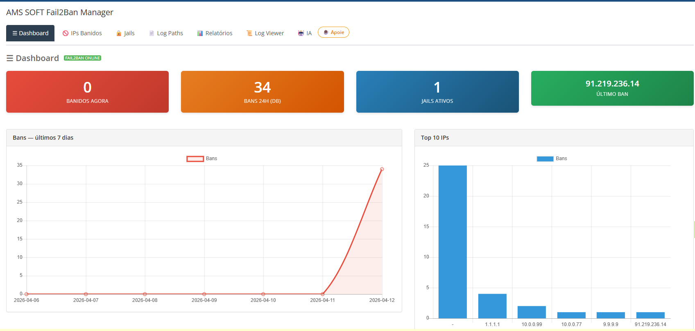
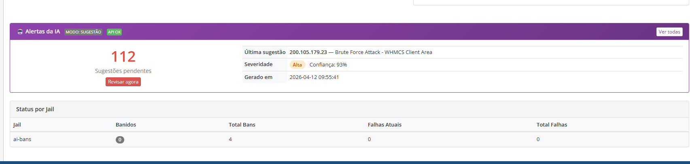

**IPs Banidos**

| Lista de IPs | Ban manual |
|---|---|
| 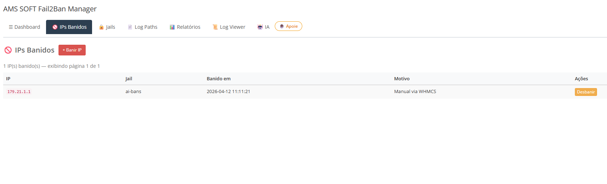 | 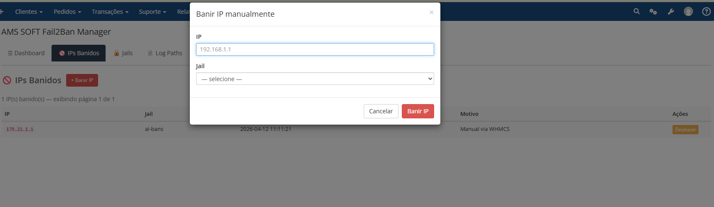 |

**Jails**

| Lista de Jails | Criar novo Jail |
|---|---|
| 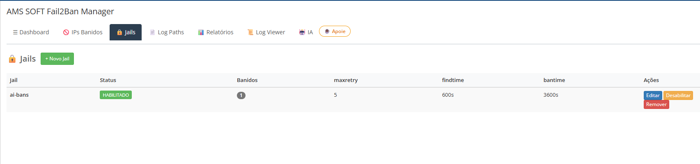 | 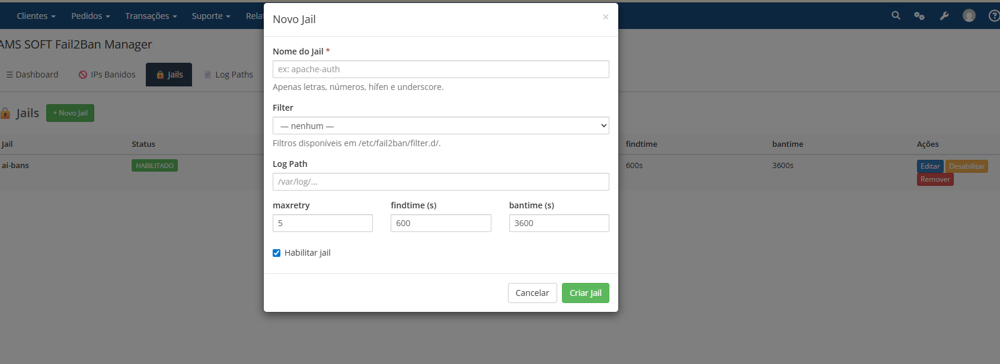 |

**Log Paths · Relatórios · Log Viewer**

| Log Paths | Relatórios | Log Viewer |
|---|---|---|
| 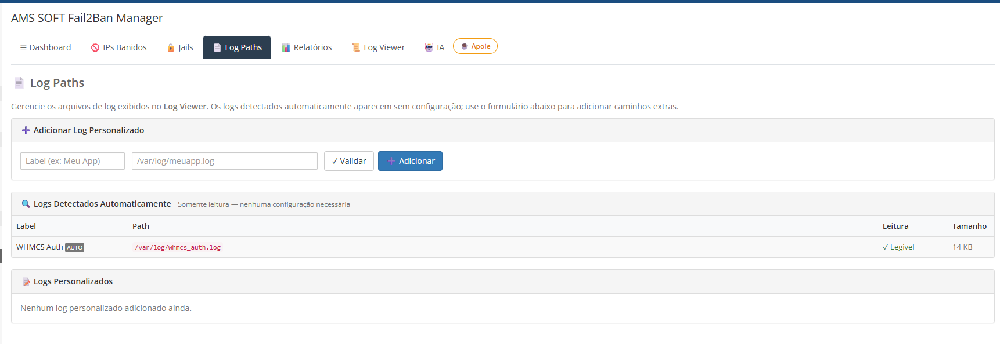 | 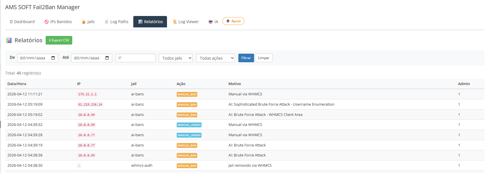 | 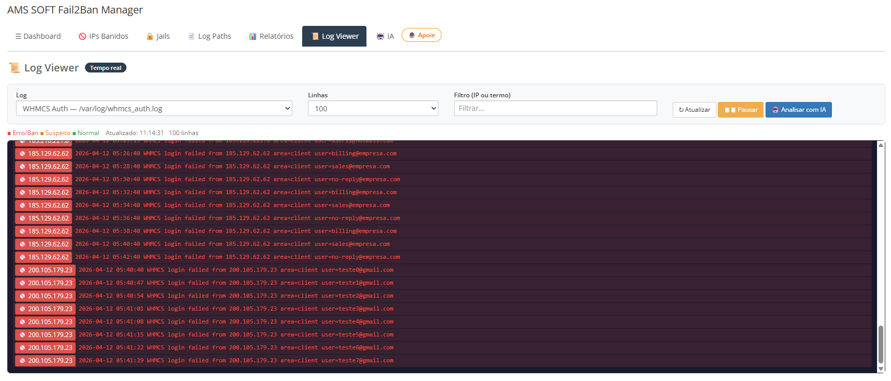 |

**IA — Análise e Sugestões (Claude / Anthropic)**

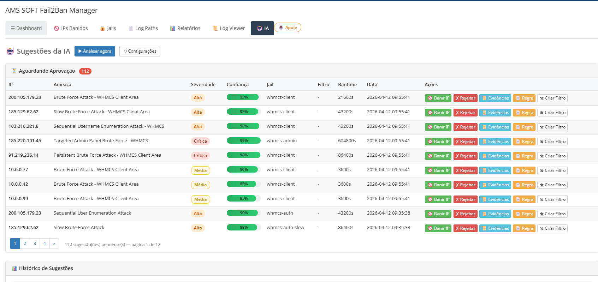
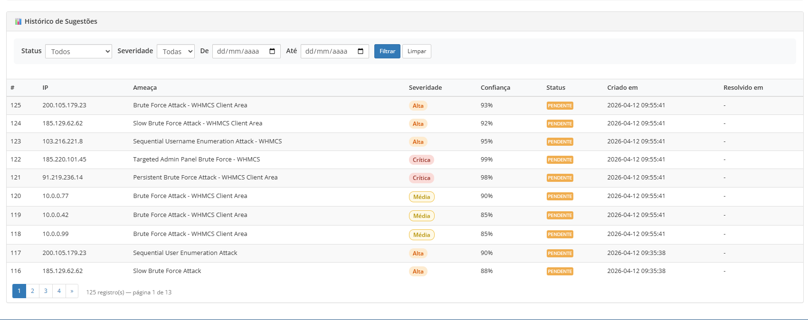

| Configurações da IA | Prompt personalizado |
|---|---|
| 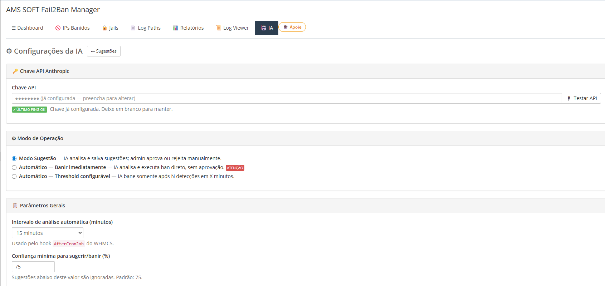 | 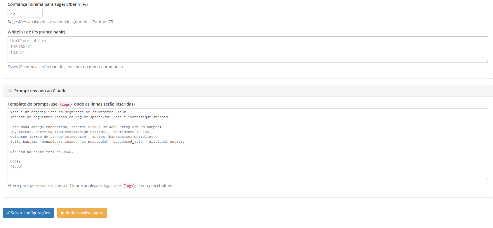 |

---

## ⚠️ Aviso — Módulo em Construção

Este módulo ainda está sendo desenvolvido e pode conter falhas ou precisar de ajustes. Ele está aberto ao público no GitHub para que a comunidade possa contribuir e ajudá-lo a melhorar cada vez mais. Pull requests, issues e sugestões são muito bem-vindos!

## Funcionalidades

- **Dashboard** com 4 KPIs em tempo real: IPs banidos agora, bans nas últimas 24h, jails ativos e último ban
- **Gráficos interativos** Chart.js: linha (evolução dos últimos 7 dias) + barra horizontal (Top 10 IPs mais bloqueados)
- **IPs Banidos** — lista ao vivo com ban/unban por botão, sem terminal
- **Gerenciamento de Jails** — habilitar/desabilitar e editar parâmetros (maxretry, findtime, bantime) pelo painel
- **Log Paths** — mapeamento de logs por jail com validação AJAX inline (✓/✗)
- **Log Viewer** — visualização dos logs de ataque direto no painel, com auto-descoberta de arquivos
- **Relatórios** — paginados com filtros e exportação CSV (UTF-8 BOM, compatível com Excel)
- **Hook automático** — captura falhas de login de clientes e admins no WHMCS e alimenta o fail2ban automaticamente
- **IA (Claude / Anthropic):**
  - Analisa linhas de log e identifica ameaças com nível de severidade e confiança
  - Sugere banimento de IPs suspeitos com um clique
  - Gera `failregex` (padrão de ataque) e cria filtro + jail no fail2ban automaticamente
  - Para sugestões antigas sem `failregex`, a IA gera o filtro on-demand a partir das evidências armazenadas
  - Tudo sem acessar o terminal

## Requisitos

- WHMCS 9+
- PHP 8.1+
- Debian/Ubuntu (testado; outros distros podem precisar de ajuste de paths)
- fail2ban instalado
- sudo instalado
- Usuário do servidor web: `www-data` (padrão Nginx/Apache no Debian/Ubuntu)

---

## Instalação Completa (Passo a Passo)

> ⚠️ **Importante:** copie o módulo para o servidor **antes** de executar os passos de configuração do sistema — os arquivos de setup estão dentro da pasta do módulo.

### Passo 1 — Instalar fail2ban e sudo

```bash
apt-get update
apt-get install -y fail2ban sudo
```

> Em muitas imagens de VPS e containers o **sudo** e o **fail2ban** não estão instalados por padrão.

### Passo 2 — Copiar o módulo para a pasta correta

```bash
cp -r amssoft_fail2ban /var/www/html/modules/addons/
```

### Passo 3 — Ajustar permissões da pasta do módulo

```bash
chown -R www-data:www-data /var/www/html/modules/addons/amssoft_fail2ban/
find /var/www/html/modules/addons/amssoft_fail2ban/ -type d -exec chmod 755 {} \;
find /var/www/html/modules/addons/amssoft_fail2ban/ -type f -exec chmod 644 {} \;
```

### Passo 4 — Configurar o sudoers (permite www-data chamar fail2ban-client sem senha)

```bash
cp /var/www/html/modules/addons/amssoft_fail2ban/setup/sudoers/amssoft_fail2ban \
   /etc/sudoers.d/amssoft_fail2ban
chmod 0440 /etc/sudoers.d/amssoft_fail2ban
visudo -c   # valida a sintaxe antes de aplicar
```

> O arquivo concede `NOPASSWD` apenas para os subcomandos necessários do `fail2ban-client` e inclui `Defaults:www-data !requiretty`, necessário para execução via servidor web.
>
> Verifique se `/etc/sudoers` contém a linha `@includedir /etc/sudoers.d` (presente por padrão no Debian/Ubuntu).

### Passo 5 — Instalar o filtro fail2ban para WHMCS

```bash
cp /var/www/html/modules/addons/amssoft_fail2ban/setup/fail2ban/filter.d/whmcs.conf \
   /etc/fail2ban/filter.d/whmcs.conf
```

### Passo 6 — Configurar o jail.local

Crie ou substitua o `/etc/fail2ban/jail.local` com o conteúdo abaixo.

> ⚠️ Em Debian 12+ o `/var/log/auth.log` não existe (o sistema usa journald). O jail `[sshd]` padrão falha ao iniciar caso não seja desabilitado explicitamente.

```bash
cat > /etc/fail2ban/jail.local << 'EOF'
# Desabilita o jail sshd padrão (sem /var/log/auth.log no Debian 12+/journald)
[sshd]
enabled = false

# Jail para falhas de login no WHMCS
[whmcs]
enabled  = true
filter   = whmcs
logpath  = /var/log/whmcs_auth.log
maxretry = 5
findtime = 600
bantime  = 3600
EOF
```

### Passo 7 — Ajustar permissões do jail.local

O painel do WHMCS (processo `www-data`) precisa ter permissão de **escrita** no `jail.local` para criar, editar e remover jails pela interface gráfica.

```bash
chown root:www-data /etc/fail2ban/jail.local
chmod 664 /etc/fail2ban/jail.local
chown root:www-data /etc/fail2ban
chmod 750 /etc/fail2ban
chown root:www-data /var/log/apache2
chmod 750 /var/log/apache2
chown root:www-data /var/log/apache2/*.log
chmod 640 /var/log/apache2/*.log
```

> ⚠️ Sem este passo, todas as operações de escrita (criar jail, editar parâmetros, remover jail) falharão com a mensagem "Erro ao criar jail".

### Passo 8 — Criar o arquivo de log do WHMCS

```bash
touch /var/log/whmcs_auth.log
chown www-data:www-data /var/log/whmcs_auth.log
chmod 664 /var/log/whmcs_auth.log
```

### Passo 9 — Reiniciar o fail2ban e verificar

```bash
systemctl restart fail2ban
systemctl status fail2ban
fail2ban-client status whmcs   # deve mostrar o jail ativo com 0 IPs banidos
```

---

## Atualização de versão anterior

Se você já tinha o módulo instalado, re-aplique o arquivo de sudoers para garantir que todas as regras estejam presentes (a v3 adicionou permissões para criação de filtros pela IA):

```bash
cp /var/www/html/modules/addons/amssoft_fail2ban/setup/sudoers/amssoft_fail2ban \
   /etc/sudoers.d/amssoft_fail2ban
chmod 0440 /etc/sudoers.d/amssoft_fail2ban
visudo -c
```

> O módulo exibe um aviso no topo de todas as páginas caso o sudo não esteja funcionando corretamente.

---

## Ativar o módulo no painel do WHMCS

### Passo 10 — Ativar e configurar

- Acesse **Admin → Configurações → Módulos Addon**
- Localize **AMS SOFT Fail2Ban Manager** e clique em **Ativar**
- Em **Configurar**, preencha:

| Campo | Valor padrão |
|---|---|
| Caminho do sudo | `/usr/bin/sudo` |
| Caminho do fail2ban-client | `/usr/bin/fail2ban-client` |
| Caminho do jail.local | `/etc/fail2ban/jail.local` |
| Caminho do log WHMCS | `/var/log/whmcs_auth.log` |
| Ativar hooks de login | Sim (recomendado) |

### Passo 11 — Acessar o módulo

```
https://seu-whmcs.com/admin/addonmodules.php?module=amssoft_fail2ban
```

---

## Problemas Conhecidos e Soluções

| Problema | Solução |
|---|---|
| `sudo` não instalado | `apt-get install -y sudo` |
| `fail2ban` não instalado | `apt-get install -y fail2ban` |
| fail2ban não inicia (jail sshd sem log) | Adicionar `[sshd]` com `enabled = false` ao `jail.local` |
| www-data não consegue usar sudo | Verificar `/etc/sudoers.d/amssoft_fail2ban`: `chmod 0440` e `visudo -c` |
| Arquivo de log WHMCS não existe | `touch /var/log/whmcs_auth.log && chown www-data:www-data /var/log/whmcs_auth.log` |
| fail2ban aparece offline no dashboard | Conferir os paths em **Configurar** no painel do WHMCS |
| "Erro ao criar/editar/remover jail" | Executar: `chown root:www-data /etc/fail2ban/jail.local && chmod 664 /etc/fail2ban/jail.local` |
| "Falha ao criar arquivo de filtro" (botão Criar Filtro da IA) | Sudoers desatualizado — re-aplicar conforme seção **Atualização de versão anterior** |
| Aviso amarelo "sudoers desatualizado" no painel | Idem acima — o módulo detectou automaticamente que faltam regras de `cp`/`chmod` |

---

## Estrutura de Arquivos

```
amssoft_fail2ban/
├── amssoft_fail2ban.php      # Entry point WHMCS (5 funções obrigatórias)
├── hooks.php                  # Hook de captura de falhas de login
├── lib/                       # Núcleo: Router, Fail2BanClient, JailConfig, Database, Helper, LogParser
│   ├── AIAnalyzer.php         # Integração com API Anthropic (Claude) — análise de logs e geração de failregex
│   └── FilterManager.php      # Criação de filtros e jails fail2ban gerados pela IA
├── controllers/               # Controllers MVC
├── templates/                 # Templates PHP (sem Smarty)
├── assets/                    # CSS, JS e Chart.js embutido (sem CDN externo)
├── setup/                     # Configs prontas: sudoers + filtro e jail do fail2ban
└── sql/                       # install.sql / uninstall.sql (referência; execução via activate())
```

---

## Comunidade e Contribuições

Este módulo foi recém-lançado e pode conter falhas ou comportamentos inesperados. Se você encontrar algum problema, erro ou tiver uma sugestão de melhoria, por favor abra uma **Issue** aqui no GitHub descrevendo o que aconteceu.

O módulo está aberto ao público justamente para que a comunidade WHMCS possa colaborar, testar em diferentes ambientes e ajudar a aperfeiçoá-lo. Toda contribuição — seja um relatório de bug, uma correção ou uma nova funcionalidade — é muito bem-vinda!

---

## Licença

MIT — use, modifique e distribua livremente. Pedimos apenas que mantenha os créditos: **AMS SOFT** — [www.amssoft.com.br](https://www.amssoft.com.br)

---

## Apoie o Projeto ☕

Este módulo é gratuito e de código aberto. Se ele te ajudou a economizar tempo ou proteger melhor o seu servidor, considere fazer uma doação de qualquer valor para ajudar a manter o projeto vivo, financiar melhorias e novas funcionalidades.

Toda contribuição, por menor que seja, faz diferença. Muito obrigado! 🙏

| Método | Link |
|---|---|
| Mercado Pago | [Clique aqui para doar via Mercado Pago](https://www.mercadopago.com.br/subscriptions/checkout?preapproval_plan_id=95add4219a6b47f286b1405a51a39b7b) |
| PayPal | [Clique aqui para doar via PayPal](https://www.paypal.com/ncp/payment/UZQBBQ4BQ89UQ) |
